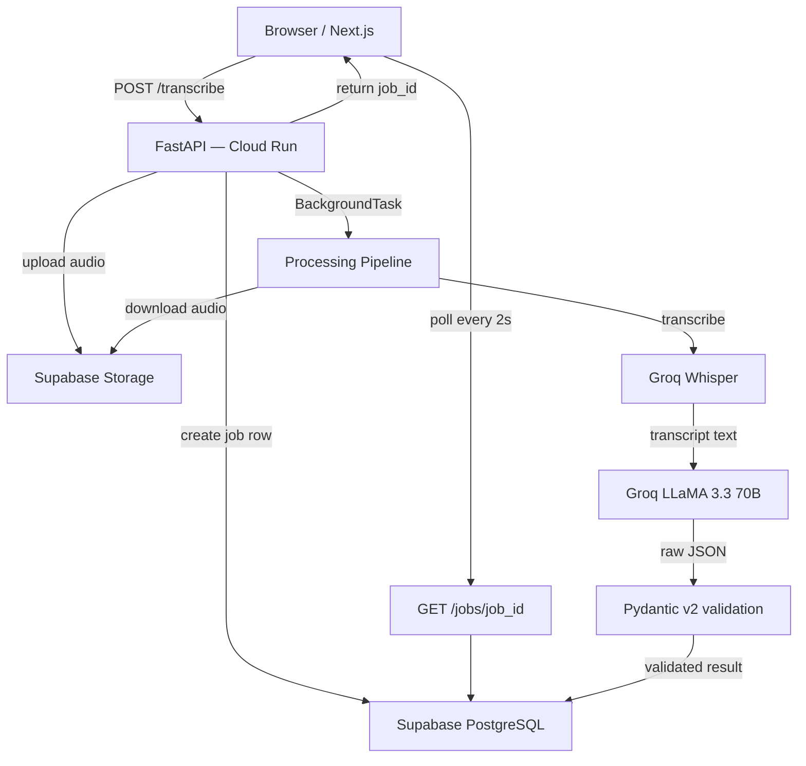

# Voxake — Backend

> Voice memo to structured intelligence. Speak naturally — get back tasks, decisions, and people, typed and ready.

**Live demo → [voxake-frontend.vercel.app](https://voxake-frontend.vercel.app)**  
**API docs → [voxake-backend-235937596309.us-central1.run.app/docs](https://voxake-backend-235937596309.us-central1.run.app/docs)**

---

## What it does

You upload a voice memo. Thirty seconds later you have a structured document — every task with its assignee and deadline, every decision recorded, every person named. No manual transcription, no copy-paste.

The interesting engineering is in the extraction layer: Pydantic schemas enforce output shape, a correction prompt handles LLM failures, and the whole thing runs async so the API returns immediately while processing happens in the background.

---

## Architecture


## Extraction schema

A single memo produces a fully typed `VoiceMemoExtraction`:

```python
class Task(BaseModel):
    title: str
    description: str
    type: TaskType          # work | health | personal | self_help
    characters: list[Person]
    deadline_iso: Optional[date]   # only when a specific date is stated
    timeline_raw: Optional[str]    # "by next Thursday", "end of week"
    priority: Optional[Priority]   # only when explicitly mentioned

class Decision(BaseModel):
    title: str
    description: Optional[str]

class VoiceMemoExtraction(BaseModel):
    transcript: str
    summary_points: list[str]   # 2–3 bullets on what the memo touched
    tasks: list[Task]
    decisions: list[Decision]
    people: list[Person]
```

The schema is the product. A blob of transcript text is useless — a validated, typed model is something you can build on.

---

## Stack

| Layer | Tool | Why |
|-------|------|-----|
| API framework | FastAPI | async-native, background tasks, auto-generated docs |
| Transcription | Groq Whisper `whisper-large-v3-turbo` | fast, free tier, handles M4A/WAV/OGG/WEBM |
| Extraction | Groq LLaMA `llama-3.3-70b-versatile` | structured JSON output, low latency |
| Validation | Pydantic v2 | strict schema enforcement, retry on failure |
| Database | Supabase PostgreSQL | job state, JSONB result storage |
| File storage | Supabase Storage | private bucket, signed URLs for download |
| Container | Docker | reproducible builds, Cloud Run compatible |
| CI/CD | GitHub Actions → Artifact Registry → Cloud Run | push to main = live |
| Rate limiting | slowapi | 5 req/min on `/transcribe`, 60 req/min on `/jobs` |

---

## Job lifecycle
pending → transcribing → processing → completed

↘ failed (with error_message)

The frontend polls `GET /jobs/{job_id}` every 2 seconds and advances a progress bar through these states.

---

## Performance

- ~15 seconds end-to-end for a 1-minute memo
- LLM extraction succeeds on first attempt for well-formed memos
- Falls back to a correction prompt on Pydantic validation failure — the broken JSON is sent back to the LLM with the validation error and asked to fix it

---

## Running locally

```bash
python -m venv venv
venv\Scripts\activate        # Windows
source venv/bin/activate     # Mac/Linux
pip install -r requirements.txt
```

Create `.env`:
SUPABASE_URL=your_project_url

SUPABASE_SERVICE_KEY=your_service_role_key

GROQ_API_KEY=your_groq_key

GROQ_MODEL=llama-3.3-70b-versatile

GROQ_WHISPER_MODEL=whisper-large-v3-turbo

```bash
uvicorn app.main:app --reload
# API docs at http://localhost:8000/docs
```

## Docker

```bash
docker build -t voxake-backend .
docker run -p 8000:8000 --env-file .env voxake-backend
```

## Deployment

Every push to `main` triggers the GitHub Actions workflow:
docker build → push to GCP Artifact Registry → deploy to Cloud Run

Secrets managed via GitHub repository secrets. Environment variables injected into Cloud Run at deploy time — never baked into the image.